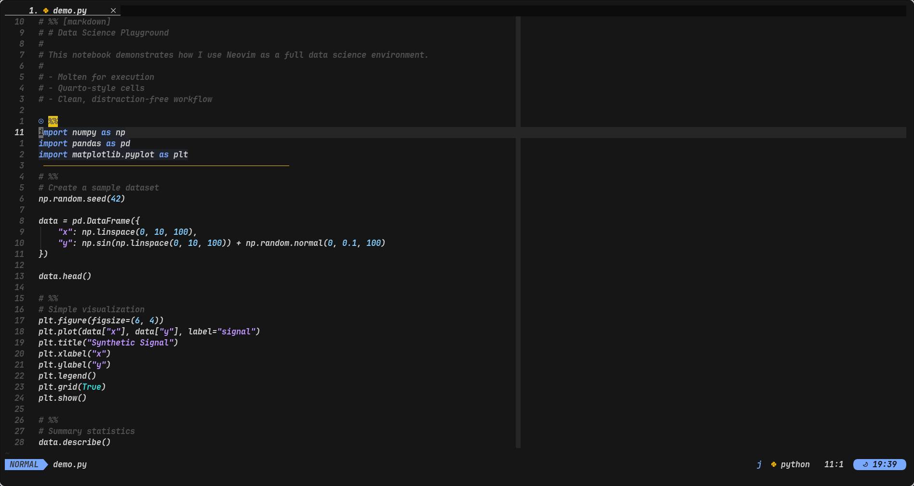
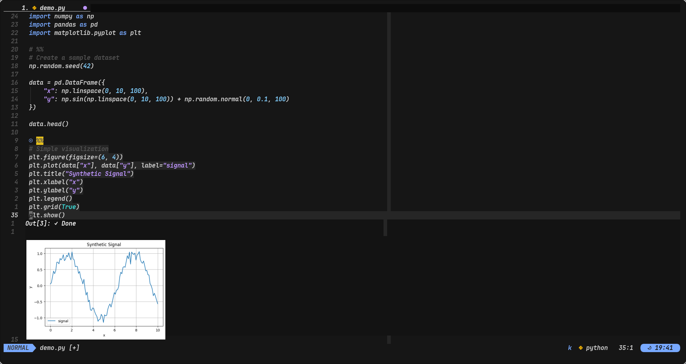
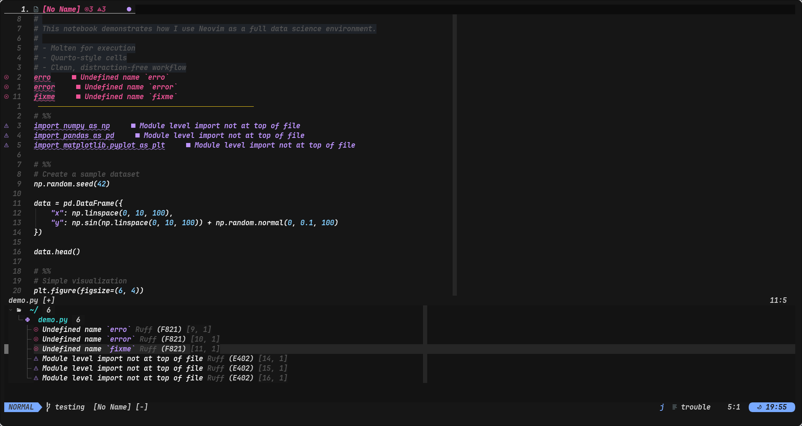
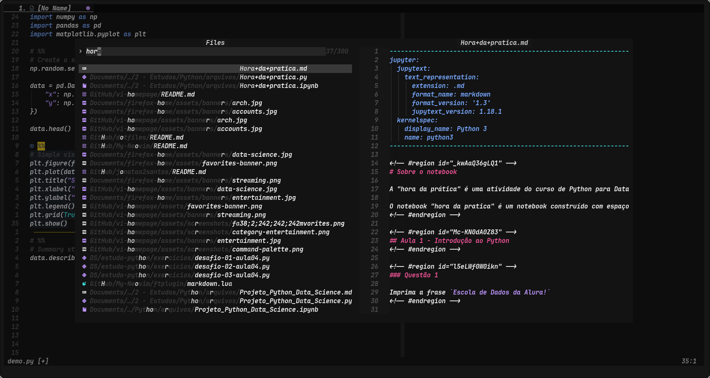
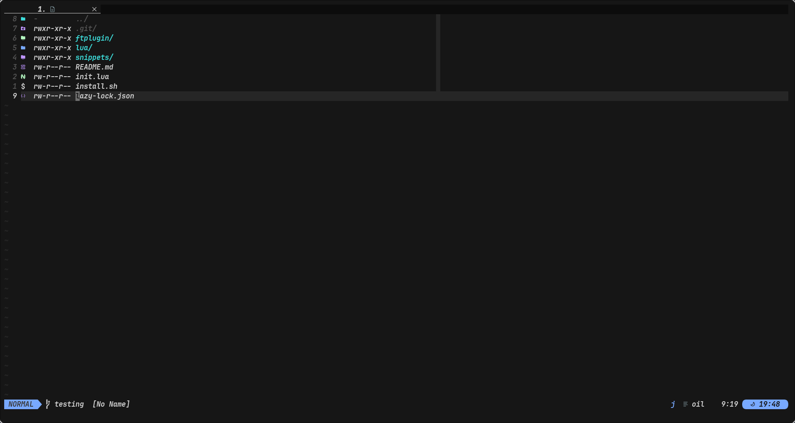
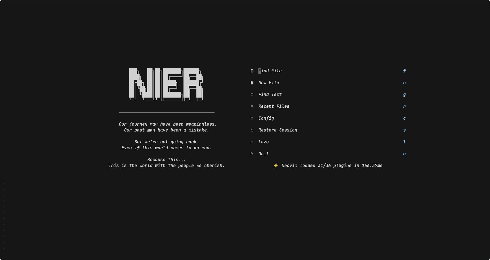

# 🧠 Neovim — Minimal Data Science Setup

A personal **Neovim configuration focused on clarity, performance and data science workflows**.
This setup is **not meant to be universal or “the best”** — it reflects how *I* like to work and evolves as my workflow evolves.

---

## 🧠 Philosophy

**Principles behind this setup:**

* **Keyboard-first**: everything important is reachable through intentional keybindings
* **Explicit > implicit**: no magic, no hidden behaviors
* **Modular structure**: options, keymaps, autocmds, plugins and ftplugins are isolated
* **Low noise**: no visual clutter, no unnecessary prompts
* **Real workflows**: designed for daily use, not for screenshots

This is not a Neovim distro - it is a **PERSONAL WORKBENCH**.

---

## 🧩 Core Features

### 🧠 Editing & Navigation
- Treesitter-based syntax highlighting
- Smart indentation
- Fast structural navigation ( Flash )
- Modern motions without breaking Vim habits


### 🧪 Data Science Workflow
- Native Jupyter-style workflow via **Molten**
- Works with `.py`, `.ipynb`, and `.qmd`
- Inline outputs and plots
- Ruff for linting, formatting and imports
- Quarto integration for reproducible research
- Cell highlight



### 🚨 Diagnostics & Troubleshooting
- Centralized diagnostics view
- Project-wide and buffer-specific errors
- Clear severity indicators
- Quick navigation between issues
- Clean and focused error display


### 🔍 Search & Navigation
- `snacks.nvim` as the main picker
- Fast fuzzy search
- Project-aware navigation


### 📁 File Management
- Fast and intuitive file navigation
- Minimal, distraction-free file explorer
- Seamless integration with buffers and tabs
- External file opening support
- Safe file operations (rename, delete, move)


### 🎨 UI / UX
- Clean dashboard
- Minimal notifications
- Subtle UI feedback
- Zero visual noise


---

## ❔ Who is this for?

This setup is ideal if you:

* Work with **Python and Data Science**
* Use **Quarto / Markdown notebooks**
* Like **Jupyter-style cells** but want Neovim speed
* Prefer **Clean keymaps** over plugin-driven UX
* Want full control over your editor behavior

Probably **not** ideal if you:

* Want VSCode-like UI
* Prefer mouse-driven workflows
* Expect everything to work without understanding Neovim

---

## 🧱 Plugin Overview

| Area | Plugin |
|------|--------|
| File Explorer | `oil.nvim` |
| Fuzzy Finder | `snacks.nvim` |
| Completion | `blink.cmp` |
| Snippets | `LuaSnip` |
| LSP | `nvim-lspconfig` |
| Formatting | `conform.nvim` |
| Diagnostics | `trouble.nvim` |
| Syntax | `nvim-treesitter` |
| Jupyter | `molten.nvim` |
| Quarto | `quarto-nvim` |
| Sessions | `persistence.nvim` |
| UI / UX | `noice.nvim`, `notify`, `colorizer` |
| Navigation | `flash.nvim` |
| Git | `lazygit` ( via snacks ) |

---

## 🔑 Leader Key

* **Leader:** `<Space>`

Semantic prefixes are used:

### Semantic prefixes

| Prefix | Meaning |
|------|--------|
| `<leader>a` | Tabs |
| `<leader>b` | Buffers |
| `<leader>g` | Git |
| `<leader>n` | Noice |
| `<leader>r` | Run |
| `<leader>s` | Search / Splits |
| `<leader>x` | Diagnostics |
| `<leader>p` | Sessions |
| `<leader>q` | Quarto |
| `<leader>m` | Molten |
| `<leader>t` | Exit / Quit |

---
## 🚀 Keymaps Overview

### Navigation ( Flash )

| Key | Action |
|-----|--------|
| `s` | Jump ( Flash ) |
| `S` | Treesitter jump |
| `r` | Remote jump |
| `R` | Treesitter search |
| `<C-s>` | Toggle Flash in search |

---

### Search / Pickers ( Snacks )

| Key | Action |
|------|--------|
| `<leader>ff` | Find files |
| `<leader>fc` | Find config files |
| `<leader>sg` | Live grep |
| `<leader>sw` | Search word / selection |
| `<leader>bb` | Buffers |
| `<leader>sm` | Marks |
| `<leader>fh` | Help |
| `<leader>si` | Icons |
| `<leader>fP` | Projects |

---

### Files & Buffers

| Key | Action |
|------|--------|
| `<leader>bd` | Delete buffer |
| `<leader>rn` | Rename file |
| `<leader>/` | Toggle terminal |

---

### LSP / Diagnostics

| Key | Action |
|------|--------|
| `<leader>xx` | Diagnostics ( project ) |
| `<leader>xb` | Diagnostics ( buffer ) |
| `<leader>xs` | Symbols |

---

### Jupyter / Quarto

| Key | Action |
|------|--------|
| `qh` | Hover |
| `qd` | Go to definition |
| `qf` | Format |
| `qR` | References |
| `qr` | Rename |

Execution is handled by **Molten**, integrated with Quarto.

---

### Snippets ( LuaSnip )

| Key | Action |
|------|--------|
| `<A-u>` | Expand snippet |
| `<A-j>` | Next field |
| `<A-k>` | Previous field |
| `<A-l>` | Change choice |

---

### File Explorer ( Oil )

| Key | Action |
|------|--------|
| `l` | Open |
| `h` | Parent directory |
| `g.` | Toggle hidden files |
| `gx` | Open externally |
| `<C-s>` | Vertical split |
| `<C-h>` | Horizontal split |

---

### Window Navigation

> **Important:** window navigation uses **ALT + SHIFT + hjkl**

| Key               | Action               |
| ----------------- | -------------------- |
| `Alt + Shift + H` | Move to left window  |
| `Alt + Shift + J` | Move to lower window |
| `Alt + Shift + K` | Move to upper window |
| `Alt + Shift + L` | Move to right window |

Works in **Normal and Insert Mode**.

---

### Insert Mode

| Key              | Action                     |
| ---------------- | -------------------------- |
| `Ctrl + h/j/k/l` | Move cursor in insert mode |
| `jk`             | Exit insert mode           |

---

### Movement & Editing

| Key              | Action                           |
| ---------------- | -------------------------------- |
| `J / K` ( visual ) | Move selection down / up         |
| `J` ( normal )     | Join lines without moving cursor |
| `Ctrl + d / u`   | Half page down / up ( centered )   |
| `n / N`          | Search next / prev ( centered )    |

---

### Text Operations

| Key          | Action                             |
| ------------ | ---------------------------------- |
| `<leader>d`  | Delete without yanking             |
| `x`          | Delete char without yanking        |
| `<leader>rw` | Replace word under cursor ( global ) |
| `<leader>h`  | Clear search highlight             |

---

### Files & Buffers

| Key         | Action               |
| ----------- | -------------------- |
| `<leader>xc` | Make file executable |
| `Ctrl + a`  | Select all           |

---

### Tabs (`<leader>a*`)

| Key          | Action                       |
| ------------ | ---------------------------- |
| `<leader>ao` | New tab                      |
| `<leader>ax` | Close tab                    |
| `<leader>an` | Next tab                     |
| `<leader>ap` | Previous tab                 |
| `<leader>ac` | Open current file in new tab |
| `<leader>as` | Move tab left ( wrap )         |
| `<leader>ad` | Move tab right ( wrap )        |
| `<leader>1-9` | Go to tab 1-9               |

---

### Splits (`<leader>s*`)

| Key          | Action           |
| ------------ | ---------------- |
| `<leader>sv` | Vertical split   |
| `<leader>sh` | Horizontal split |
| `<leader>se` | Equalize splits  |

### Sessions ( Persistence )

| Key          | Action              |
| ------------ | ------------------- |
| `<leader>pl` | Load session ( cwd )  |
| `<leader>ps` | Select session      |
| `<leader>pL` | Load last session   |
| `<leader>pd` | Stop saving session |

---

### Development

| Key          | Action                     |
| ------------ | -------------------------- |
| `<leader>rp` | Run current Python file    |
| `<leader>rm` | Run current Markdown file  |
| `<leader>fr` | Format buffer ( LSP / Ruff ) |

---

### File Explorers ( Oil & MiniFiles )

| Key         | Action                 |
| ----------- | ---------------------- |
| `-`         | Oil ( parent directory ) |
| `<leader>-` | Oil ( floating )         |
| `<leader>=` | MiniFiles              |

---

### Quarto

| Key                   | Action             |
| --------------------- | ------------------ |
| `<leader>qp`          | Preview document   |
| `<leader>qc`          | Run cell           |
| `<leader>qa`          | Run cell and above |
| `<leader>ql`          | Run line           |
| `<leader>qA`          | Run all cells      |

---

### Molten ( Jupyter Kernel )

| Key          | Action             |
| ------------ | ------------------ |
| `<leader>mi` | Initialize kernel  |
| `<leader>mc` | Evaluate cell      |
| `<leader>ml` | Evaluate line      |
| `<leader>mo` | Open output window |
| `<leader>mh` | Hide output        |
| `<leader>md` | Delete cell        |
| `<leader>mn` | Go to next cell    |
| `<leader>mp` | Go to prev cell    |

---

# ⚙️ Installation Guide

This guide explains how to install **all required dependencies** and set up this Neovim configuration properly.

## 🐧 Supported Systems

- ✅ Arch Linux ( primary target )
- 🟡 Other Linux distros ( may require adjustments )
- ⚠️ macOS / Windows ( not officially supported )

---

## 📦 Installation ( Recommended )

This setup uses a **shell script** to automate setup.

### 🔽 Download only the installer ( without cloning the repo )

> **WARNING ⚠️** This script was created to work only on pure Arch-based distributions.
Other distros must adapt package manager commands.
Download the install.sh file using wget or curl:

```bash
wget https://raw.githubusercontent.com/jonatas2santos/My-Neovim/refs/heads/master/install.sh || chmod u+x install.sh || ./install.sh
```
or
```bash
curl -LO https://raw.githubusercontent.com/jonatas2santos/My-Neovim/refs/heads/master/install.sh || chmod u+x install.sh || ./install.sh
```

## ✅ Final Checklist

- [ ] Neovim ≥ 0.10

- [ ] Nerd Font installed

- [ ] Python + pip installed

- [ ] ripgrep, fd, imagemagick installed

- [ ] Plugins installed via Lazy

- [ ] Treesitter parsers installed

- [ ] Molten working

---

## ☝️🤓 Final Notes

> This setup is not about doing everything.  
It's about doing **exactly what I need**, clearly and efficiently.

- Designed for **Arch Linux**
- Works best with a Nerd Font
- Keyboard-driven workflow
- Continuously evolving

It is a personal setup, shaped by how I like to work — not an attempt to build the “best” Neovim configuration, nor the most productive one by any universal standard.

There is no absolute goal here.
It changes as my habits change.

If you are reading this and it feels *intentional*, *quiet*, and *fast* —
then it is working exactly as intended.
